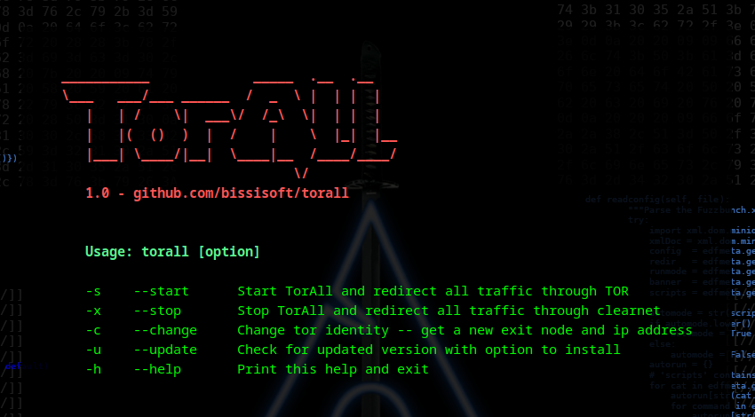
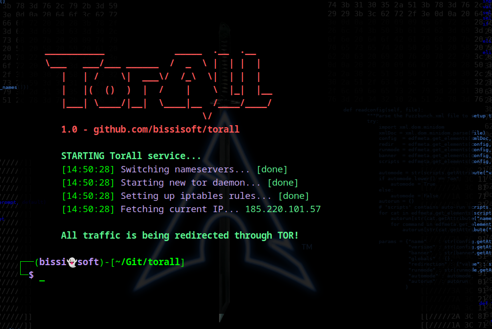
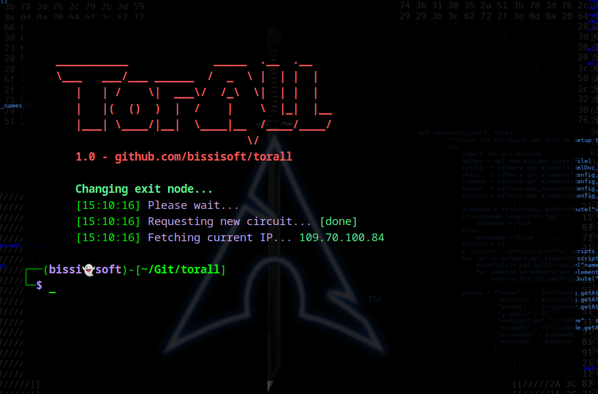

# TorAll
TorAll is an anonymization utility tool that redirects all of the system's internet traffic through the TOR network.
It's an improved fork variation of the old [TorGhost](https://github.com/SusmithKrishnan/torghost)


## Install on Debian and/or Arch Linux distributions!
```sh
git clone https://github.com/bissisoft/torall.git
cd torall
chmod +x build.sh
sudo ./build.sh
```


## Usage
```sh
sudo torall [option]
```
### options
```sh
-s    --start      Start TorAll and redirect all traffic through TOR
-x    --stop       Stop TorAll and redirect all traffic through clearnet
-c    --change     Change tor identity -- Change exit node and ip address
-u    --update     Check for updated version with option to install
-h    --help       Print this help and exit
```


